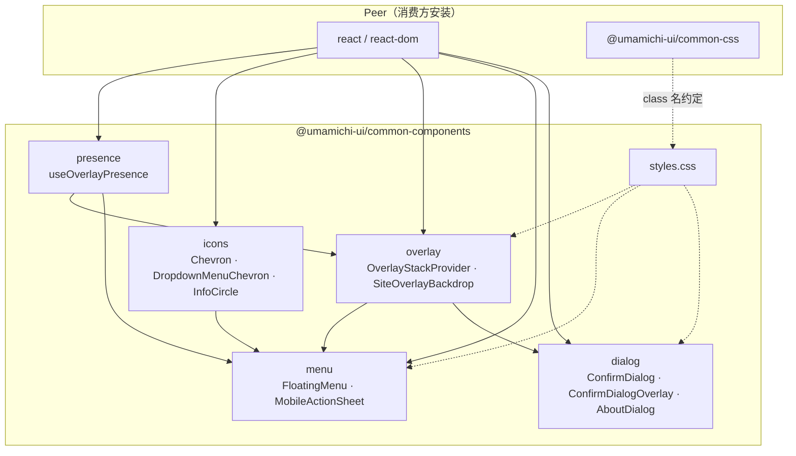

# @umamichi-ui/common-components

> 以下内容为 LLM 生成，且未经人工检查，请谨慎对待

Umamichi 站点共用的 React UI 组件库，与 [@umamichi-ui/common-css](https://www.npmjs.com/package/@umamichi-ui/common-css) 配合使用。

各子模块可单独引用，彼此尽量解耦：

| 子路径 | 内容 |
|--------|------|
| `@umamichi-ui/common-components/presence` | 进出场动画 hook（不依赖叠层栈） |
| `@umamichi-ui/common-components/overlay` | 叠层栈、`SiteOverlayBackdrop` |
| `@umamichi-ui/common-components/icons` | Chevron、下拉箭头、信息图标 |
| `@umamichi-ui/common-components/menu` | `FloatingMenu`、`MobileActionSheet` |
| `@umamichi-ui/common-components/dialog` | `ConfirmDialog`、`AboutDialog` |
| `@umamichi-ui/common-components/styles.css` | 本库补充样式（overlay、action sheet、about） |

## 依赖图

模块间**单向**依赖；`presence` 与 `icons` 为叶子模块，可被任意上层单独引用。



| 从 | 到 | 说明 |
|----|-----|------|
| `presence` | `overlay` | `SiteOverlayBackdrop` 进出场动画 |
| `presence` | `menu` | `FloatingMenu` 面板淡入（不进叠层栈） |
| `icons` | `menu` | 下拉箭头；ActionSheet 子菜单 Chevron |
| `overlay` | `menu` | `MobileActionSheet` 底部 backdrop |
| `overlay` | `dialog` | `ConfirmDialogOverlay` |
| `dialog`（内部） | — | `AboutDialog` → `ConfirmDialog` + `ConfirmDialogOverlay` |

**无库内依赖：** `ConfirmDialog`（纯 markup 壳）、`computeFloatingMenuGeometry`、`OverlayStackProvider` 自身逻辑。

`menu` 子模块内：`FloatingMenu` 只走 `presence`；`MobileActionSheet` 额外依赖 `overlay`。

## 使用

```tsx
import '@umamichi-ui/common-css';
import '@umamichi-ui/common-components/styles.css';
import { OverlayStackProvider } from '@umamichi-ui/common-components/overlay';

// 根组件
<OverlayStackProvider>
  <App />
</OverlayStackProvider>
```

`MobileActionSheet` 与 `ConfirmDialogOverlay` 需要外层已挂载 `OverlayStackProvider`。`FloatingMenu` 仅需 `presence` hook，不进入叠层栈。

## 开发

```bash
npm install
npm run build
```

本地联调可在消费项目中添加：

```json
"@umamichi-ui/common-components": "file:../umamichi-ui/common-components"
```
